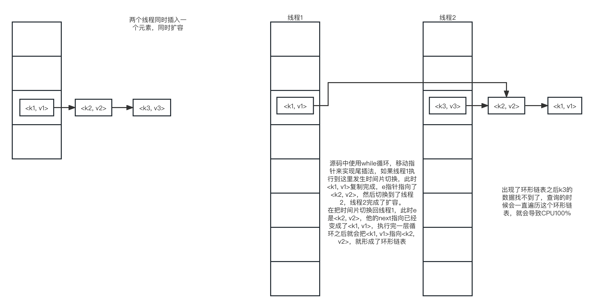

HashMap是采用数组存储元素，计算key的hash值，用hash值对数组长度取模，在对应的索引放入元素，如果存在hash冲突，就会使用单向链表，如果链表的长度超过8，链表**可能**会变成红黑树，为什么是可能，因为在转红黑树的时候会先判断数组的长度是不是小于64，如果是就进行扩容不转红黑树。红黑树的查询复杂度是O(lg^n^)。

HashMap的元素属性：

```java
static class Node<K,V> implements Map.Entry<K,V> {
    final int hash;
    final K key;
    V value;
    Node<K,V> next;

    Node(int hash, K key, V value, Node<K,V> next) {
        this.hash = hash;
        this.key = key;
        this.value = value;
        this.next = next;
    }
}
```

底层数组：

```java
transient Node<K,V>[] table;
```

使用set保存key

```java
transient Set<Map.Entry<K,V>> entrySet;
```

```java
loadFactor：扩容的阈值
threshold：元素超过多少开始扩容，这个是根据loadFactor算出来的
```

***

put方法

```java
public V put(K key, V value) {
    // 计算key的hash值，在调用putVal方法
    return putVal(hash(key), key, value, false, true);
}

/**
 * 现获取hash值，在获取hash值的高16位
 * 再把原来的hash值和移完位的值做异或运算（相同是0，不同是1）
 * 其实就是高16位和低16位异或运算，这样保证元素分布的更均匀，因为在寻址的时候，数组长度很小，一般使用的都是低16位，
 * 如果不这么做，相当于一直都是低16位在运算
 */
static final int hash(Object key) {
    int h;
    return (key == null) ? 0 : (h = key.hashCode()) ^ (h >>> 16);
}

final V putVal(int hash, K key, V value, boolean onlyIfAbsent, boolean evict) {
    Node<K,V>[] tab; Node<K,V> p; int n, i;
    // table就是底层数组
    // 把table赋值给tab，数组长度赋值给n
    if ((tab = table) == null || (n = tab.length) == 0)
        // 如果table是空的，进行resize，第一次会把数组大小设成16，threshold设置成12
        n = (tab = resize()).length;
    // 如果数组在这个索引上没有元素，就直接放进去
    // (n - 1) & hash是一个高性的寻址操作，但是只有n是2的n次方的时候才好使
    if ((p = tab[i = (n - 1) & hash]) == null)
        tab[i] = newNode(hash, key, value, null);
    else {
        Node<K,V> e; K k;
        // 如果这个位置有元素了，hash值和key都相同，就把p赋值给e
        if (p.hash == hash && ((k = p.key) == key || (key != null && key.equals(k))))
            e = p;
        // 如果冲突的位置是红黑树，就直接添加节点
        else if (p instanceof TreeNode)
            e = ((TreeNode<K,V>)p).putTreeVal(this, tab, hash, key, value);
        // key不同的hash冲突，目前还是单向链表的结构
        else {
            // 遍历链表，找到最后一个元素，添加新元素
            for (int binCount = 0; ; ++binCount) {
                if ((e = p.next) == null) {
                    p.next = newNode(hash, key, value, null);
                    // 当链表的长度大于等于8，就变成红黑树
                    if (binCount >= TREEIFY_THRESHOLD - 1) // -1 for 1st
                        treeifyBin(tab, hash);
                    break;
                }
                if (e.hash == hash &&
                    ((k = e.key) == key || (key != null && key.equals(k))))
                    break;
                p = e;
            }
        }
        // e不等于null就说明是相同的key，覆盖value
        if (e != null) { // existing mapping for key
            V oldValue = e.value;
            if (!onlyIfAbsent || oldValue == null)
                e.value = value;
            afterNodeAccess(e);
            return oldValue;
        }
    }
    ++modCount;
    if (++size > threshold)
        // 扩容
        resize();
    afterNodeInsertion(evict);
    return null;
}

/**
 * 链表转红黑树代码
 * 先转双向链表，再转红黑树
 */
final void treeifyBin(Node<K,V>[] tab, int hash) {
    int n, index; Node<K,V> e;
    // 如果数组的长度小于64的时候会扩容，不会转红黑树
    if (tab == null || (n = tab.length) < MIN_TREEIFY_CAPACITY)
        resize();
    else if ((e = tab[index = (n - 1) & hash]) != null) {
        TreeNode<K,V> hd = null, tl = null;
        do {
            // 转成红黑树
            TreeNode<K,V> p = replacementTreeNode(e, null);
            if (tl == null)
                hd = p;
            else {
                p.prev = tl;
                tl.next = p;
            }
            tl = p;
        } while ((e = e.next) != null);
        if ((tab[index] = hd) != null)
            hd.treeify(tab);
    }
}
```

***

扩容代码：每次都是扩容成原来的两倍，所以扩容之后的地址可能是原来的index，也可能是原来的index在加上原来的数组的大小。

```java
final Node<K,V>[] resize() {
    Node<K,V>[] oldTab = table;
    int oldCap = (oldTab == null) ? 0 : oldTab.length;
    int oldThr = threshold;
    int newCap, newThr = 0;
    // 重新计算数组大小和阈值
    if (oldCap > 0) {
        if (oldCap >= MAXIMUM_CAPACITY) {
            threshold = Integer.MAX_VALUE;
            return oldTab;
        }
        else if ((newCap = oldCap << 1) < MAXIMUM_CAPACITY &&
                 oldCap >= DEFAULT_INITIAL_CAPACITY)
            newThr = oldThr << 1; // double threshold
    }
    else if (oldThr > 0) // initial capacity was placed in threshold
        newCap = oldThr;
    else {               // 初始化的时候执行
        newCap = DEFAULT_INITIAL_CAPACITY;
        newThr = (int)(DEFAULT_LOAD_FACTOR * DEFAULT_INITIAL_CAPACITY);
    }
    if (newThr == 0) {
        float ft = (float)newCap * loadFactor;
        newThr = (newCap < MAXIMUM_CAPACITY && ft < (float)MAXIMUM_CAPACITY ?
                  (int)ft : Integer.MAX_VALUE);
    }
    threshold = newThr;
    @SuppressWarnings({"rawtypes","unchecked"})
    Node<K,V>[] newTab = (Node<K,V>[])new Node[newCap];
    table = newTab;
    // 处理所有的元素
    if (oldTab != null) {
        for (int j = 0; j < oldCap; ++j) {
            Node<K,V> e;
            if ((e = oldTab[j]) != null) {
                oldTab[j] = null;
                // 索引上就一个元素，直接移动到新数组上去
                if (e.next == null)
                    newTab[e.hash & (newCap - 1)] = e;
                // 红黑树的移动
                else if (e instanceof TreeNode)
                    ((TreeNode<K,V>)e).split(this, newTab, j, oldCap);
                // 链表的移动
                else { // preserve order
                    Node<K,V> loHead = null, loTail = null;
                    Node<K,V> hiHead = null, hiTail = null;
                    Node<K,V> next;
                    // 遍历链表
                    do {
                        next = e.next;
                        // 元素和就数组长度做与运算是0，扩容之后的index不变
                        if ((e.hash & oldCap) == 0) {
                            if (loTail == null)
                                loHead = e;
                            else
                                loTail.next = e;
                            loTail = e;
                        }
                        // 反之扩容之后的index是原来的index在加上原来的数组的大小
                        else {
                            if (hiTail == null)
                                hiHead = e;
                            else
                                hiTail.next = e;
                            hiTail = e;
                        }
                    } while ((e = next) != null);
                    if (loTail != null) {
                        loTail.next = null;
                        newTab[j] = loHead;
                    }
                    if (hiTail != null) {
                        hiTail.next = null;
                        newTab[j + oldCap] = hiHead;
                    }
                }
            }
        }
    }
    return newTab;
}
```

HashMap在高并发下是线程不安全的，前提是发生时间片切换后扩容的头尾指针对于扩容后数组的长度存在hash冲突，并且恰好在应该扩容时多线程插入数据。



在1.8之后，扩容的时候不会改变指针的指向。