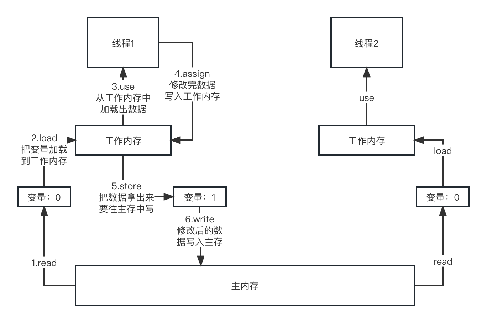
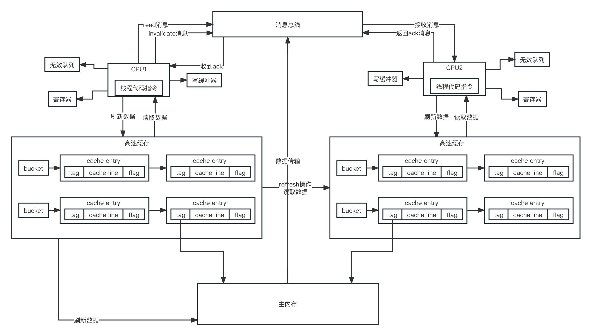

volatile是为了解决修改数据后，其他线程可以立即感知到数据的变化。

因为CPU读写主内存的速度比较低，所以数据的处理都是在CPU缓存中。CPU会读写的自己缓存，缓存在刷新到主内存或者别的地方，提高性能。但是这样的话就会导致别的线程修改了数据，不会马上写回主内存，就算写回主内存，有些线程可能也不会去主内存读，还是读取自己的缓存中的数据。

被volatile修饰后就符合MESI协议，当数据被修改之后也就是assign步骤结束后，会强制执行store和write操作，同时所有CPU会嗅探到数据过期，在重新读取数据。

### java内存模型



可以看出来和CPU的缓存模型很像，也存在同样的问题，线程1在修改数据后，线程2感知不到。

### 并发三大问题

*   可见性：上面说得都是可见性。

*   原子性：多个线程读，一个线程写，会发生可见性，如果多个线程写就会发生原子性了，可能两个线程都执行+1操作，结果执行完了结果还是1。jvm规定变量的简单赋值都是原子性的，包括引用类型的赋值。复杂的赋值比如i = j + 2;这种待计算的就不保证原子性。但是在32位虚拟机中，赋值long和double是不保证原子性的，加上volatile就可以了，但是仅仅在这种情况使用volatile可以保证原子性。

*   有序性：编译器和指令器会进行指令重排。在静态编译（javac）和动态编译（JIT）过程中，都可能会发生指令重排，尤其是JIT。处理器在收到JIT编译好之后的机器码指令后，可能对指令进行重排序，处理器执行完到写缓冲器、无效队列、高速缓存中执行指令可能又发生下指令重排。

处理器在执行的时候哪个指令先就绪，就执行哪个指令，执行完了以后把结果放到重排序处理器，重排序处理器根据CPU收到的指令顺序把结果写到高度缓存或者写缓冲器中。

volatile是无法保证保证原子性的，因为就算数据被强制加载到工作内存，但是线程可能正在修改或者正在执行write操作，这时候就算工作内存中的数据变化了，也没用。

### MESI协议



tag是保存主内存中数据的地址，flag是数据的状态，cache line里可以包含多个变量，就是具体的值。

处理器根据index、tag、offect来定位到数据，index定位到缓存中的bucket，tag定位到tag entry，offect定位到cache line中的数据。

flag的状态：

*   invalid：无效的

*   shared：共享的

*   exclusive：独占的

*   modified：修改过的

读取数据的时候，CPU1向总线发送read消息，主内存把数据返回，这时，数据的flag是S（共享的），修改数据的时候向总线发送invalidate消息，其他CPU嗅探到这条消息会把数据的flag变成I，然后返回ack给总线，CPU收到所有CPU的ack消息之后把flag变成E，修改完了把flag改成M，有的处理器还会把主内存的数据刷新。其他CPU在读取数据的时候发现flag是I，就要在发送read消息。这样会有一个问题，操作数据变成串行了，效率非常低。

在发invalidate消息之前把数据写到写缓冲器里，就可以去干别的了，收到invalidate消息之后把消息写到无效队列中，就返回ack，CPU1收到所有处理器的ack之后从写缓冲器中取出写入的数据，把flag变成E，然后在修改数据，在变成M，其他处理器从无效队列中消费完消息就把flag变成I，然后返回ack。这种异步的就会导致消息不会马上更新到高速缓存或者主内存，产生了可见性问题。还可能发生StoreLoad、StoreStore。

从图中可以看出，可见性是因为处理器更新数据副本可能写到寄存器、高速缓存或者写缓冲器，写到这几个地方其他处理器都不能马上感知到数据的变化。

flush操作：在刷新数据到写缓冲器的同时，也要把数据刷新到高速缓存中，有的硬件还需要把数据刷到主内存中，刷新完了会发送消息到消息总线。

refresh操作：处理器接收到总线的消息后会把变量副本过期，然后从发消息的处理器的高速缓存或者主内存中加载数据（根据硬件决定）。

***

### happens-before

只要是符合这个原则，就不能重排序。

### 内存屏障

Load屏障：执行refresh操作，收到invalidate消息之后马上修改flag为I；

Store屏障：执行flush操作，把数据写到写缓冲器中后必须等到所有ack之后写到高速缓存或者主内存中；

Acquire屏障（LoadLoad + LoadStore）：禁止读操作和读写操作发生指令重排；

Release屏障（StoreLoad + StoreStore）：禁止写操作和读写操作发生指令重排；

```java
boolean volatile isRunning;

// Release屏障
isRunning = false;
// Store屏障

// Load屏障
while(isRunning) {
// Acquire屏障
    ……
}
```

