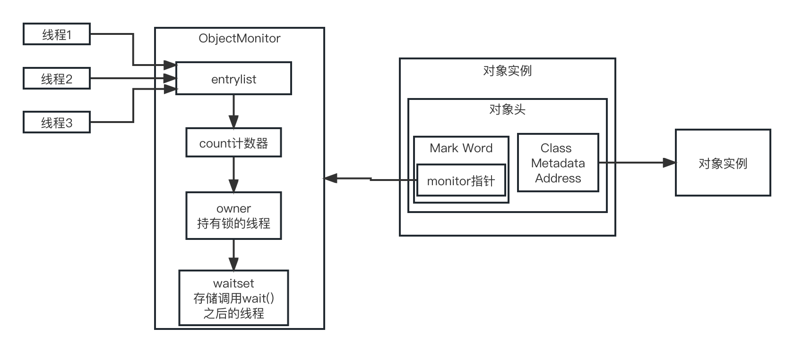
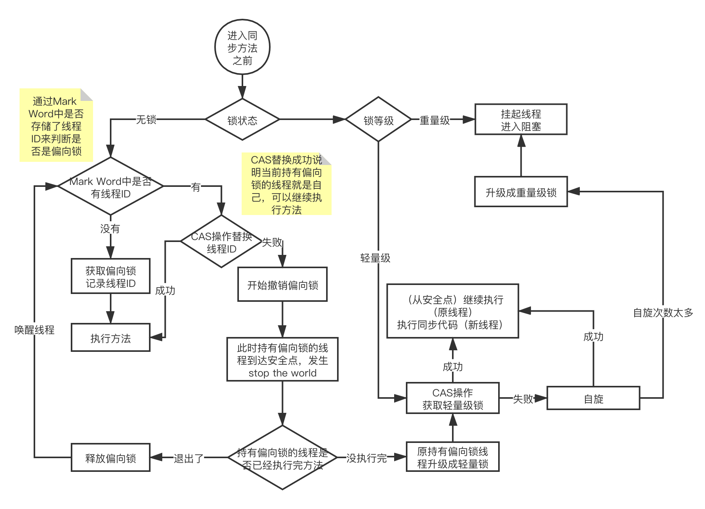

Synchronized原理



Mark Word结构


Synchronized修饰普通方法，锁的是实例对象，修饰的是静态方法的时候锁的是类，class对象。

每个对象都有monitor对象，monitor中有一个计数器，编译的时候碰到了Synchronized时候会生成MonitorEnter和对应的MonitorExit，线程执行到Synchronized修饰的代码块或者方法的时候，先看看monitor对象中的计数器是不是0，如果不是0就根据owner判断持有锁的对象是不是自己，如果不是就等待，如果是就把计数器在加1，调用wait方法的时候会把计数器清0，owner变成null，然后waitset中添加当前线程，调用notify的时候就唤醒waitset中的线程。

双重检查的单例需要使用volatile并不是因为volatile的可见性，因为Synchronized本身就可以保证可见性，而是因为双重检查的写法可能会导致指令重排，打乱了创建对象实例的时候的顺序，比如单例的构造函数中实例化了其他的对象，可能会重排成对象没实例化，但是指针有了，这时候线程2走if判断，发现是true直接返回实例，但是实例的对象还没全部初始化，只是有了一个指针，用这个实例就会有问题。加上volatile根据happens-before原则不会进行重排序。

synchornized使用锁来保证原子性，通过在释放锁的时候执行flush操作，在进入代码块的时候执行refresh操作，通过内存屏障来解决有序性，和可见性。

在执行完monitorenter之后会执行Load内存屏障，执行monitorexit之后会执行Store内存屏障。

```java
// synchronized通过Acquire和Release屏障可以保证代码块内部和外部不发生指令重排
// 代码块里面还是可能会发生指令重排
int b = 0;
int c = 0;

synchronized(this) { // -> monitorenter

// Load内存屏障
// Acquire内存屏障

int a = b;
c = 1;

// Release内存屏障

} // -> monitorexit

// Store内存屏障
```

### 锁升级

##### 偏向锁

偏向锁就是在Mark Word中存储线程ID，为了提升同一个线程多次加锁释放锁的性能，比如循环调用Synchronized代码块，如果高并发而且并不存在同一个线程多次调用同一个Synchronized代码块时，会频繁的发生stop the world和CAS，影响性能，这时候应该关闭偏向锁：

```shell
-XX:-UseBiasedLocking
```

##### 轻量锁

当CAS无法替换偏向锁的线程ID就会升级成轻量锁，轻量锁适合线程交替执行同步周期内不存在长时间竞争的同步代码块的场景。

##### 自旋锁和重量级锁

自旋锁是在轻量锁升级成重量所之间，防止刚进入阻塞队列就被唤醒，在轻量锁获取失败后会自旋一定次数，这个次数现在不能自定义设置了，如果到次数了还没获取到轻量锁就会升级成重量锁，线程也会进入管城的阻塞队列，高并发的时候一直CAS也会消耗CPU，JVM关闭自旋锁设置：

```shell
-XX:-UseSpinning
```



### 锁消除和锁粗化

* 锁消除：当JIT在动态编译同步块的时候，使用逃逸分析判断这段代码只能被一个线程调用时，就不会生成获取锁和释放锁的机器码。
* 锁粗化：JIT动态编译的时候发现相邻Synchronized同步快锁的是同一个对象实例就会把这些同步快合并成一个大的同步块。

### wait和notify

wait让线程进入等待状态，关键的是他可以让线程释放锁，notify唤醒线程。他俩主要是用来控制线程的，必须要在Synchronized中使用。notify是唤醒某一个线程，notifyAll唤醒所有线程。

wait可以指定超时时间，超过时间自己就醒了。
