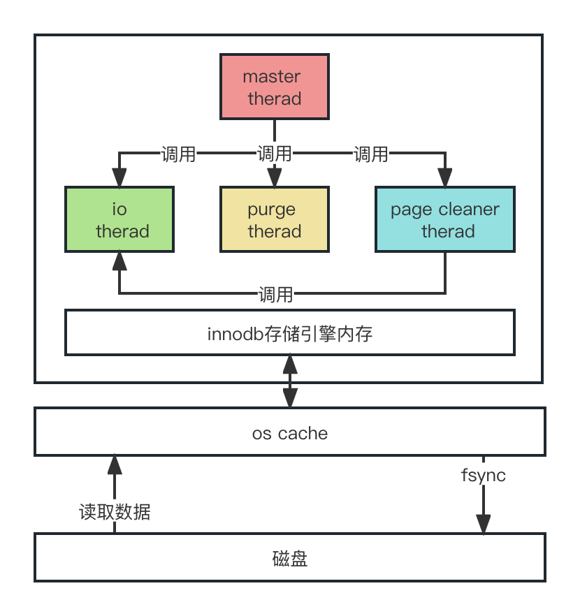

DDL：数据库定义语句，用来操作数据库中的表、索引、试图、存储过程等；

DML：增删改查；

DCL：控制语句，授权什么的；

TCL：事务控制语句；

### 常见的连接池

DBCP、C3P0、Druid

MySQL自己也有一个连接池；

### 日志

* undo log：存储更新前的值，为了事务回滚和MVCC（版本并发控制）；

* redo log：搜索引擎中存储的操作日志，防止数据库宕机，是InnoDB特有的，偏物理性质的重做日志，记录的是对那个**数据页**中的那条记录做了什么修改；redo log是固定文件数循环写。

* binlog：MySQL server自己的日志文件，对**表**中那一条数据做了什么操作，结果是什么；binlog会不断产生新文件。

### 一条sql语句的执行步骤

当MySQL内部线程从网络连接解析出来一条sql语句的时候会提交SQL接口（MySQL提供的一个组件）去执行，SQL接口把sql语句交给SQl解析器，解析器将SQL按照SQL语法进行拆解，在到查询优化器找到最优查询路径最后通过执行器把优化后的最优路径方案一步一步提交给存储引擎执行。操作数据成功后，redo log中已经有了记录，这时候会添加binlog记录，binlog记录成功后会在redo log中写入这次更新数据的binlog文件名和文件中的位置，然后在redo log中写入commit标记，然后提交事务，到此，一条sql语句才算执行成功了。

##### innodb内存模型

io thread：处理读写操作，使用show engine innodb status可以查看io 现成信息，一般分成4类：

1.   read thread：负责把数据页加载到内存；
2.   write thread：把脏页刷新到磁盘；
3.   log thread：把内存中的日志刷到磁盘；
4.   insert buffer thread：将change buffer内容刷到磁盘；

purge thread：事务提交之后回收不需要的undo log，通过innodb_purge_threads配置数量；

page cleaner thread：通过innodb_page_cleaners配置数量，默认是1个，他是负责调用write thread的。

master thread：主线程，负责调用其他线程，他有每秒的操作，也有每10秒的操作。
**每秒的操作：**

1.   脏页达到75%的时候刷新脏页到磁盘，每次刷新200个；
2.   当1s的io次数小于5时合并写缓冲区数据；
3.   刷新日志缓冲区，没有提交的事务涉及到的redo log也会刷新；

**每10秒的操作：**

1.   刷新脏页到磁盘，每次刷200(innodb_io_capacity)个；
2.   合并写缓冲区的数据，合并innodb_io_capacity * 5%个；
3.   刷新日志缓冲区；
4.   删掉没用的undo log；

