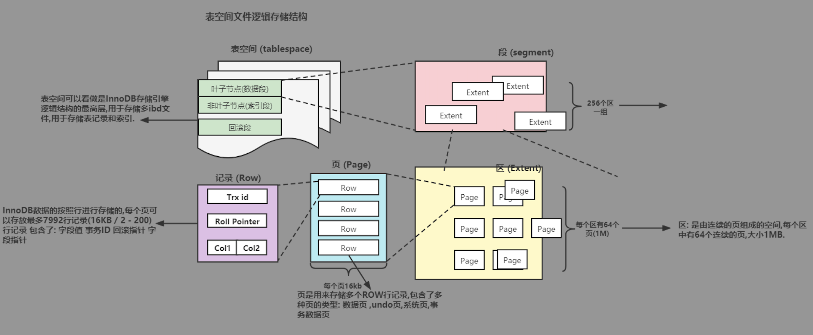

### 一 表空间

表空间是用来存储表的结构和数据的，InnoDB中表空间分为以下几种：

1.   系统表空间：system tablespace，也叫共享表空间，对应的物理文件是var/lib/mysql/ibdata，这个表空间存了很多东西会越来越大。

     系统表空间内容：

     *   数据字典：表结构、数据库名、表名、试图、索引等等元数据
     *   change buffer
     *   doubleWrite buffer files：双写缓冲区，为了解决写失效问题，因为操作系统的os cache每页只有4k，默认情况下一个缓存页有16k，所以要把一个缓存页刷新到os cache后再刷到磁盘，需要再os cache中刷4次，如果刷到一半服务器挂了，这个时候这个数据页就是不完整的，**这就是写丢失问题**。为了解决这种极端情况，在把刷剧刷到磁盘之前innodb会把数据复制到一个2M的内存中，通过这个2M的内存向共享表空间的doubleWrite buffer顺序写，如果doubleWrite buffer顺序写成功，在进行正常的数据页刷新，如果写双写缓冲区的时候失败，其实就算刷盘失败了，但是不会产生坏掉的数据页，如果刷数据页失败在重启之后会使用双写缓冲区的数据页来恢复。
     *   undo logs

2.   独立表空间：file-per-table tablespaces，默认情况下表的数据文件存在独立表空间中，每个库都有自己对应的文件夹，独立表空间是在var/lib/mysql/库名/表名.idb文件，这个文件不能拆分，所以数据越大文件越大，表结构的信息除了存储到系统表空间之外也会在表空间统计的.frm文件中，8.0之后所有的表结构信息都在系统表空间中。

3.   通用表空间：MySQL5.7之后支持，类似系统表空间，可以创建表的时候把表空间指定到通用表空间。

4.   撤销表空间：undo tablespaces，用来保存undo log的，undo log默认存在系统表空间里，也就是存在ibdata文件中，5.7之后可以通过undo_log_truncate+innodb_undo_tablespaces参数设置让undo log保存到对应的撤销表空间。这样可以解决系统表空间越来越大的问题。8.0之后默认会把undo log放到撤销表空间里。

5.   临时表空间：temporary tabespaces，5.7之后独立出来的，之前也在系统表空间里，存储的是临时表数据，对应的文件是MySQL数据文件夹里的ibtmpl文件，初始16M，也是自动扩容的，会越来越大，当内存里的临时表空间满了的时候会刷新到磁盘里，可以设置临时表空间的大小，重启时ibtmpl里的内容会被释放。

##### 1）表空间的逻辑结构

一个表空间包括多个段(segement)，每个段包括多个区(extent)，每个区有多个页(page)，每个也有多条数据(row)。
表空间：相当于innodb存储引擎存储的最高层，用来存储多个idb文件，每个idb文件都是独立的表空间。
段：他是一个逻辑概念，用来申请空间和回收，一个段有256个区，常见的段有数据段、索引段、回滚段等等。
区：由连续的页组成的空间，一个区有64个页，默认情况下一个页16k，所以一个区就是1M。
页：存储多个连续row，常见的页类型有数据页、undo页、索引页等等。



##### 2）page结构

innoDB的数据都是以页为单位存储的，每个数据页都有一个38字节的file header(描述信息) + 56字节的page header(存储页状态) + infimum + supermum records(26字节的最大最小行记录) + user records(存储的数据行记录) + free space(空闲空间大小) + page directory(页目录，存储数据记录的偏移量) + file trailer(8字节文件尾，用来校验页的完整性)。

file header中有上一页信息，file trailer有下一页的信息，这样数据页之间就组成了一个双向链表。

##### 3）行数据结构

行格式有4种，可以在建表的时候指定row_format或者alter table修改，5.7之后默认使用dynamic。

数据库中有些类型的数据是不固定长度的，比如varchar(20)，但是你可能只存1个‘a’，所以需要一个标记来记录不定长的字段中的数据长度，标记使用的是16进制，还要有记录列名、类型的信息，然后你还有可以为null的列，需要记录可以为空的列到底有没有数据，compact格式的行数据大概是这个样子的：

```shell
# 前两个16进制存储的是地址1的长度、姓名1的长度（逆序存储）
# 中间的8位bit数就是null值列表，存储的是可以为null的列
# 只要某一列可以为空就要在null值列表中有一个占位，当列为空时存0，不为空时存1
# null值列表一定是8的整数倍，不足时在头部补0，也是逆序存储
0x03 0x03 00000101 头字段 姓名1 地址1
```

40位的头字段详细信息：

*   前两位没用，预留位；
*   第3位：delete_mask，标记这行数据是否被删除；
*   第4位：min_rec_mask，标记的是否是B+树中本层非叶子节点的最小值；
*   第5-8位：n_owned；
*   第9-21位：heap_no；当前记录在数据区的位置；
*   第22-24位：record_type，0表示普通记录，1表示非叶子结点记录，2表示最小记录，3表示最大记录；
*   最后16位：next_record，下一条数据的位置；

真实数据就是上面例子中的**姓名1 地址1**存的其实是数据库编码之后的数据，而且真实数据中还会有一些隐藏的信息：

*   DB_ROW_ID：是一行数据的唯一标识，不是我们表的主键，如果表没有主键，MySQL会自动生成一个ROW_ID作为主键；
*   DB_TRX_ID：事务id，记录当前那个事务在操作这行数据；
*   DB_ROLL_PTR：回滚指针指向对应的undo log；

##### 4）行溢出

一个数据页固定为16k也就是能存储16384个字节，当一行数据超过16k时，就会使用很多个数据页来存储这一行数据，这就叫行溢出。

发生行溢出时，针对于过长数据过长的列，比如varchar(55532)，数据页只保存该列768字节的前缀数据+20字节指向溢出页的指针，剩下的数据会放到溢出页中。

##### 5）其他行格式

5.7新引入的dynamic格式新增了数据压缩功能、大索引前缀和增强型长列数据的页外存储。

当遇见过长列的时候不会再当前页存储768字节的数据了，而是只存储20字节的溢出页的地址，这个叫完全溢出。